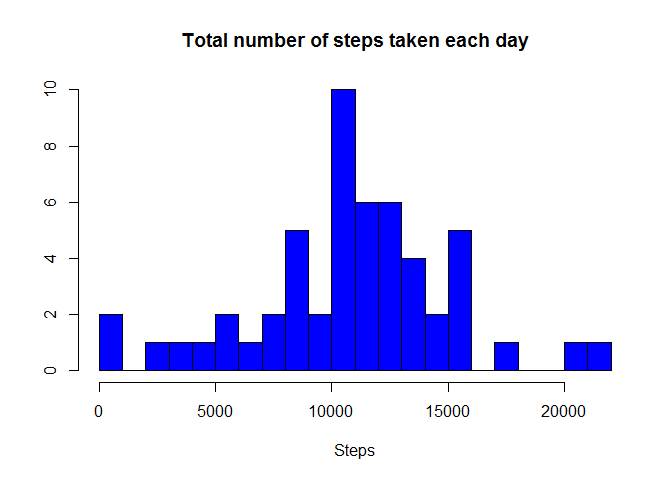
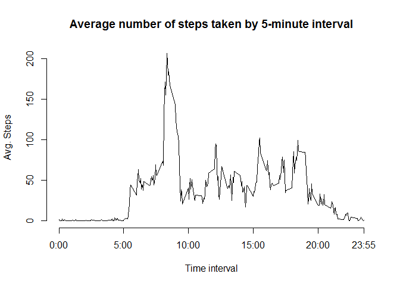
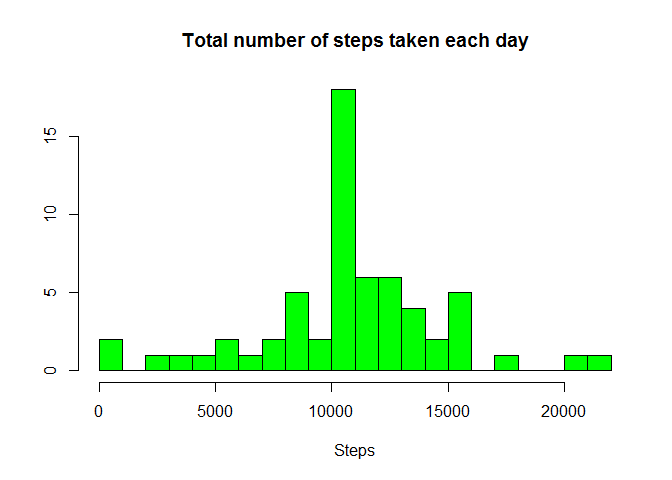
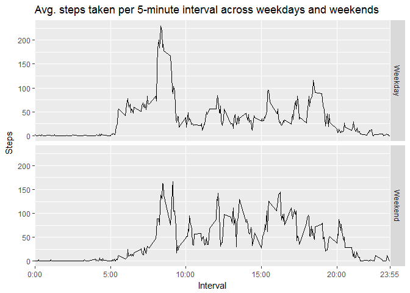

# Reproducible Research: Peer Assessment 1

<!-- Z:\Z\Coursera Data Science\Github\RepData_PeerAssessment1 -->

## Loading and preprocessing the data

```r
data <- read.csv("./activity.csv")
data1 <- data[!is.na(data$steps), c("steps","date")]
```

#### Histogram of the total number of steps taken each day

```r
data2 <- aggregate(steps~date, data=data1, FUN = sum)
hist(data2$steps, 20, main = "Total number of steps taken each day", xlab="Steps", ylab="", col="blue")
```

<!-- -->


## What is mean total number of steps taken per day?

```r
mean(data2$steps)
```

```
## [1] 10766.19
```

```r
median(data2$steps)
```

```
## [1] 10765
```


## What is the average daily activity pattern?

```r
data4 <- aggregate(steps ~ interval, data, mean, rm.na = TRUE)
plot(data4$interval, data4$steps, type = "l", axes=F, xlab = "Time interval", ylab="Avg. Steps", main = "Average number of steps taken by 5-minute interval")
axis(1, labels = c('0:00', '5:00', '10:00', '15:00', '20:00', '23:55'), at = c(0, 500, 1000, 1500, 2000, 2355))
axis(2)
```

<!-- -->


#### The 5-minute interval that, on average, contains the maximum number of steps

```r
data4[which.max(data4$steps),"interval"]
```

```
## [1] 835
```


## Imputing missing values

```r
# Missing values
sum(is.na(data$steps))
```

```
## [1] 2304
```

```r
# Fill the missing values with 5-minute interval mean
data6 <- data
for (i in 1:nrow(data6))
{
    if (is.na(data6$steps[i]))
    {
        data6$steps[i] <- data4[(data4$interval==data6$interval[i]),2]
    }
}

# See the differences. Not much, except 3rd quartile
summary(data)
```

```
##      steps                date          interval     
##  Min.   :  0.00   2012-10-01:  288   Min.   :   0.0  
##  1st Qu.:  0.00   2012-10-02:  288   1st Qu.: 588.8  
##  Median :  0.00   2012-10-03:  288   Median :1177.5  
##  Mean   : 37.38   2012-10-04:  288   Mean   :1177.5  
##  3rd Qu.: 12.00   2012-10-05:  288   3rd Qu.:1766.2  
##  Max.   :806.00   2012-10-06:  288   Max.   :2355.0  
##  NA's   :2304     (Other)   :15840
```

```r
summary(data6)
```

```
##      steps                date          interval     
##  Min.   :  0.00   2012-10-01:  288   Min.   :   0.0  
##  1st Qu.:  0.00   2012-10-02:  288   1st Qu.: 588.8  
##  Median :  0.00   2012-10-03:  288   Median :1177.5  
##  Mean   : 37.38   2012-10-04:  288   Mean   :1177.5  
##  3rd Qu.: 27.00   2012-10-05:  288   3rd Qu.:1766.2  
##  Max.   :806.00   2012-10-06:  288   Max.   :2355.0  
##                   (Other)   :15840
```

#### Histogram of the total number of steps taken each day after missing values are imputed

```r
data7 <- aggregate(steps~date, data=data6, FUN = sum)
hist(data7$steps, 20, main = "Total number of steps taken each day", xlab="Steps", ylab="", col="green")
```

<!-- -->


#### Mean and median values

```r
mean(data7$steps)
```

```
## [1] 10766.19
```

```r
median(data7$steps)
```

```
## [1] 10766.19
```
##### Imputing missing values has no effect on the Mean but the median value is converging to the mean value


## Are there differences in activity patterns between weekdays and weekends?

```r
data8 <- data6
# Get day names
data8$dayCategory <- weekdays(as.Date(data8$date))
# Identify weekdays/weekends
data8$dayCategory <- ifelse(data8$dayCategory %in% c("Saturday", "Sunday"), "Weekend", "Weekday")
# Calculate averages
data8 <- aggregate(steps ~ dayCategory + interval, data8, mean)
data8$dayCategory <- as.factor(data8$dayCategory)
# Plot the data
library(ggplot2)
plot <- ggplot(data8, aes(interval, steps, group = dayCategory))
plot + 
    geom_line() + 
    geom_line() + 
    facet_grid(dayCategory ~ .) + 
    scale_x_discrete(limit = c(0, 500, 1000, 1500, 2000, 2355), labels = c('0:00', '5:00', '10:00', '15:00', '20:00', '23:55')) + 
    labs(x="Interval", y="Steps", title="Avg. steps taken per 5-minute interval across weekdays and weekends")
```

<!-- -->


